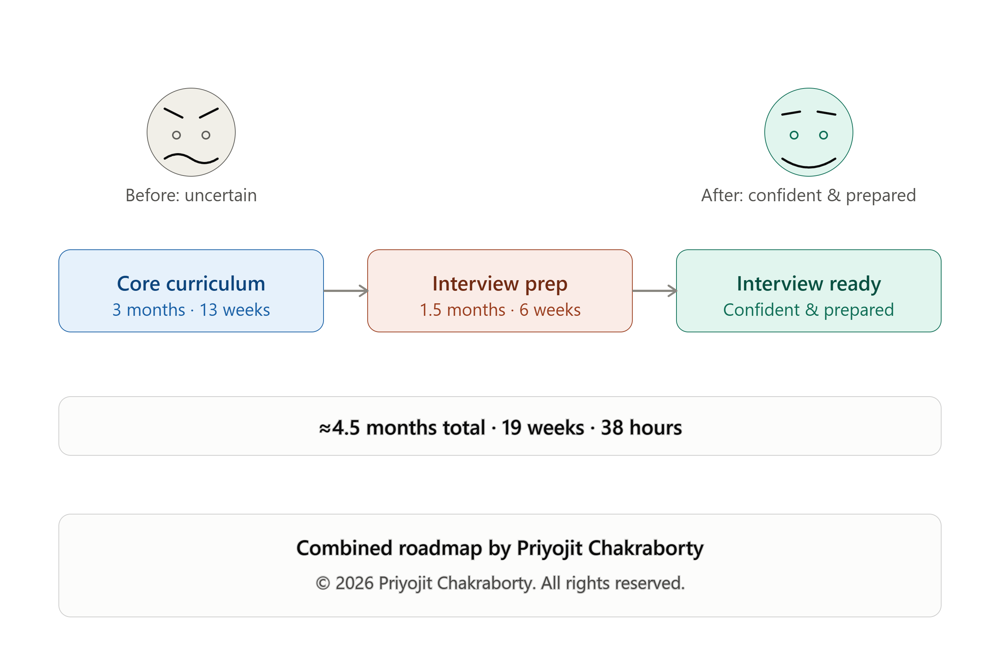
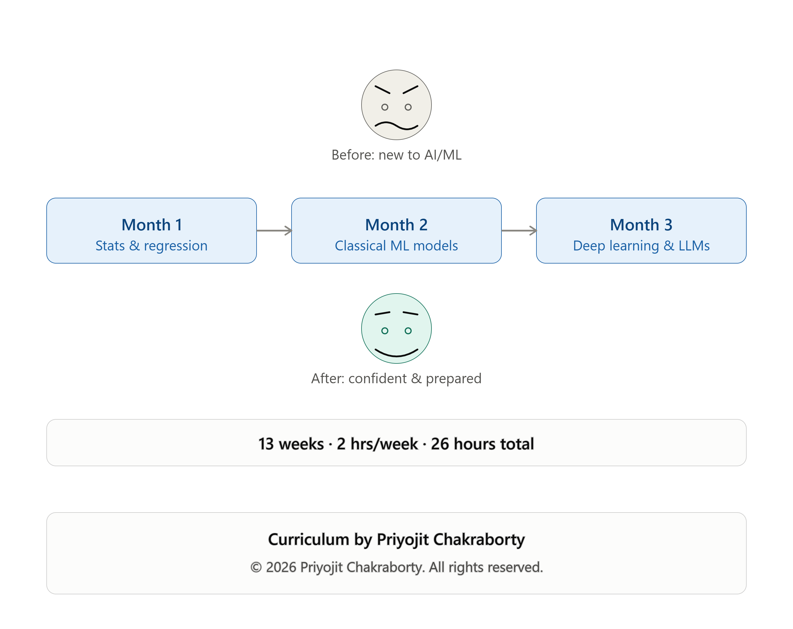
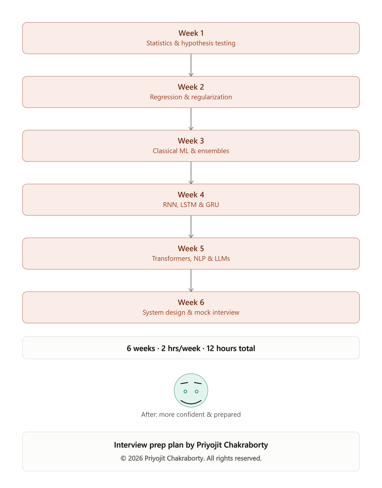

# AI/ML Learning & Interview Preparation Program

Welcome to the AI/ML learning and interview preparation program.

This program is designed for students and working professionals who want a structured learning path for AI/ML and focused preparation for AI/ML technical interviews.

## Program Registration

**Registration is completely free.**

👉 **Register here:** [[GOOGLE FORM REGISTRATION LINK](https://forms.gle/D1ET6KyqMSvw59Gs9)]

The registration form collects your basic details and your selected learning option.

You can register now without making any payment.

## Program Options

| Program | Duration | Fee |
|---|---:|---:|
| Full AI/ML Study Course | 3 Months | ₹3,000 |
| Interview Preparation | 1.5 Months | ₹3,000 |
| Full AI/ML Study Course + Interview Preparation | 3 Months + 1.5 Months | ₹6,000 |

### Important

The **Introduction Class is free** for registered participants.

The Introduction Class will explain:

- The complete course structure
- Learning roadmap
- Weekly class structure
- Practical learning approach
- Interview preparation approach
- How the program will continue after the introduction class

After the Introduction Class, participants who want to continue with the selected program will need to complete the applicable payment.

Payment can be skipped during registration and completed after the introduction class.

## Course Curriculum

The complete curriculum is provided in the Excel files below.

### AI/ML 3-Month Curriculum

[3_Month_AI_ML_Course_Curriculum.xlsx](3_Month_AI_ML_Course_Curriculum.xlsx)

[AI_ML_3Month_Course_Plan.xlsx](AI_ML_3Month_Course_Plan.xlsx)

The 3-month course covers the major AI/ML foundations and modern AI topics, including:

- Statistics and probability
- Hypothesis testing and A/B testing
- P-value, confidence intervals and statistical concepts
- Linear and logistic regression
- Lasso, Ridge and Elastic Net
- RFE and VIF
- R² and Adjusted R²
- Loss functions and optimization
- Decision Trees and ensemble methods
- Random Forest, AdaBoost and XGBoost
- KNN, K-Means and SVM
- ML evaluation and model validation
- Neural networks and deep learning
- CNN
- Faster R-CNN
- Mask R-CNN
- RNN, LSTM and GRU
- NLP fundamentals
- Tokenization, embeddings and Transformers
- BERT, BART and RoPE
- LLMs
- Embeddings and vector search
- RAG
- Agents and tool calling
- AI evaluation
- Production concepts, APIs, Docker and observability
- Weekly interview-focused discussions

## Learning Roadmap

### Combined Roadmap

### Core 3-Month AI/ML Curriculum

### Interview Preparation Roadmap

## Interview Preparation

The interview preparation program is designed as a focused track covering technical concepts, problem-solving, interview questions and structured preparation.

Detailed coverage is available in:

[interview_prep_1_5month_roadmap_v2.png](interview_prep_1_5month_roadmap_v2.png)

The interview preparation track can also be taken together with the complete AI/ML course.

## Payment

Payment is **not required at the time of registration**.

After the free introduction class, participants who decide to continue can use the payment gateway below.

### Payment Gateway

👉 **Make Payment:** [PAYMENT GATEWAY LINK]

Available options:

- Full AI/ML Study Course — ₹3,000
- Interview Preparation — ₹3,000
- Both Combined — ₹6,000

After payment, keep the payment/reference ID available. The reference ID will be used to verify successful payments and activate the selected program.

## Registration Flow

**1. Register for free**  
Fill in the Google Form with your details and selected program.

**2. Attend the Introduction Class**  
The introduction class is free and will explain the complete structure and roadmap.

**3. Decide whether to continue**  
Payment is required only for continuing after the introduction class.

**4. Complete payment**  
Select the applicable program and make the payment through the payment gateway.

**5. Submit the payment reference ID**  
Provide the transaction/reference ID so the payment can be verified.

**6. Continue with the program**  
Once the payment is successfully verified, access/instructions for the selected program will be shared.

## Who Can Join?

The program is suitable for:

- Students starting their AI/ML journey
- Working professionals moving into AI/ML
- Professionals looking to strengthen ML fundamentals
- Learners preparing for AI/ML technical interviews
- Candidates interested in GenAI and Agentic AI

## Getting Started

Start with the free registration:

👉 **[[REGISTER NOW — GOOGLE FORM LINK](https://forms.gle/D1ET6KyqMSvw59Gs9)]**

Registration is free, and payment is not required before the Introduction Class.
